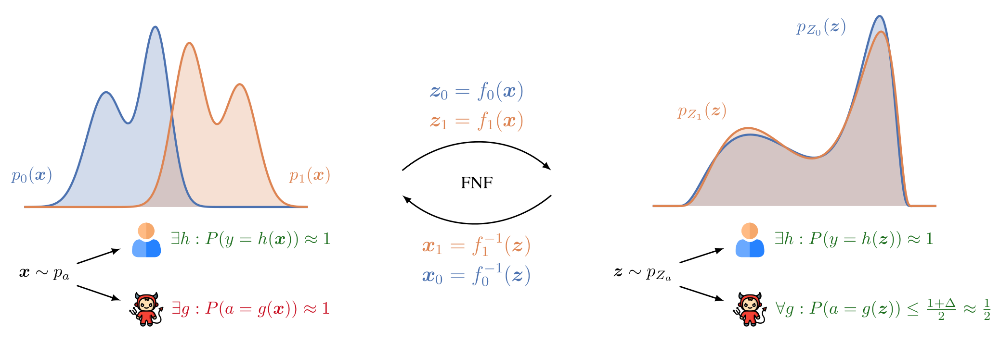

# Fair Normalizing Flows <a href="https://www.sri.inf.ethz.ch/"></a>



FNF (Fair Normalizing Flows) is a new architecture for learning representations from which it is not possible to reconstruct sensitive attributes. It is introduced in our [ICLR 2022 paper](https://arxiv.org/abs/2106.05937).
The key idea is to learn two normalizing flows, one for each possible value of a binary sensitive attribute.
Training is performed so that posterior distributions obtained through both of the flows are roughly equal.

## Setup Instructions

We suggest you use a virtual environment (e.g.,
[Anaconda](https://wwww.anaconda.com/)) with Python 3.6 or higher.
First, please install required libraries:
```
pip install -r requirements.txt
```

To prepare the folders, please run:

```
./scripts/prepare.sh
```

## Reproducing the experiments

To reproduce the results on a toy Gaussian example comparing adversarial representations and FNF, as shown in Figure 3, please run:

```
python toy_adv.py
python toy_fnf.py
```

To reproduce the results in Figure 4a (FNF on continuous datasets), please run:

```
python scripts/run_crime_gammas.py --with_test
python scripts/run_law_gammas.py --with_test
python scripts/run_health_gammas.py --with_test
```

To reproduce the results in Figure 4b (FNF on categorical datasets), please
run:

```
python train_gen_categorical.py --dataset compas --batch_size 256 --n_epochs 100 --hidden 20
python train_gen_categorical.py --dataset adult --batch_size 256 --n_epochs 100
python scripts/run_compas_gamma.py --with_test
python scripts/run_adult_gamma.py --with_test
```

You can find the results for each dataset in its subfolder in logs directory.
Each run with different seed is in a different file, where each row represents
model trained with different gamma and values shown in a row are: gamma,
statistical distance, unbalanced validation accuracy, balanced validation
accuracy, unbalanced test accuracy, balanced test accuracy, adversarial
validation accuracy, adversarial test accuracy, demographic parity, and
equalized odds. For each model, statistical distance and adversarial accuracy
are also used to produce Figure 5.

To reproduce the results for Table 1 with Adversarial Forgetting and MaxEnt-ARL
clone the
[repository](https://github.com/umgupta/fairness-via-contrastive-estimation)
of the paper
[Controllable Guarantees for Fair Outcomes via Contrastive Information Estimation](https://arxiv.org/abs/2101.04108)
by Gupta et al. Then follow the instructions in `README.md` on the experiments
about predicting c from z.

To reproduce the results for Table 1 with LAFTR follow the instructions in
`laftr/REAMDE.md` to run the full sweep of fair classification experiments,
i.e., `laftr/sweeps/full_sweep_adult/sweep.json`. Then,
run `laftr/sweeps/full_sweep_adult/attacks_original.sh` and
`laftr/sweeps/full_sweep_adult/attacks_prediction.sh` to attack the learned
representations with adversaries from inside and outside the training family G,
respectively. The attack results are stored under
`laftr/experiments/full_sweep_adult/MODEL_NAME/attack/attack_results.csv`
(adversary from model family) and
`laftr/experiments/full_sweep_adult/MODEL_NAME/attack/200_200_200/attack_results.csv`
(adversary outside of model family).

To reproduce the results on algorithmic recourse, please run:

```bash
python law_flow_multi.py --prior gmm --batch_size 128 --n_epochs 100 --adv_epochs 100 --gamma 0.0 --seed 100 --train_dec --kl_start 0 --kl_end 50 --log_epochs 10 --gmm_comps1 8 --gmm_comps2 8 --lr 1e-2 --weight_decay 1e-4 --n_blocks 4 --p_val 0.2 --p_test 0.2 --save-encoding
python law_flow_multi.py --prior gmm --batch_size 128 --n_epochs 100 --adv_epochs 100 --gamma 1.0 --seed 100 --train_dec --kl_start 0 --kl_end 50 --log_epochs 10 --gmm_comps1 8 --gmm_comps2 8 --lr 1e-2 --weight_decay 1e-4 --n_blocks 4 --p_val 0.2 --p_test 0.2 --save-encoding
```

and finally the jupyter notebook `interpretability_lawschool.ipynb`.

To reproduce the results from Figure 9, please run:

```bash
python crime_flow_multi.py --prior gmm --batch_size 128 --n_epochs 60 --adv_epochs 60 --gamma 0.0 --seed 100 --train_dec --kl_start 0 --kl_end 50 --log_epochs 10 --gmm_comps1 4 --gmm_comps2 2 --lr 1e-2 --weight_decay 1e-4 --n_blocks 4 --p_val 0.2 --p_test 0.2 --save-encoding
python crime_flow_multi.py --prior gmm --batch_size 128 --n_epochs 60 --adv_epochs 60 --gamma 1.0 --seed 100 --train_dec --kl_start 0 --kl_end 50 --log_epochs 10 --gmm_comps1 4 --gmm_comps2 2 --lr 1e-2 --weight_decay 1e-4 --n_blocks 4 --p_val 0.2 --p_test 0.2 --save-encoding
```

and finally the jupyter notebook `interpretability_crime.ipynb`.

To reproduce the results from Table 3, please run:

```bash
python scripts/run_clf_baseline.py
```

## Citing This Work

```
@inproceedings{
    balunovic2022fair,
    title={Fair Normalizing Flows},
    author={Mislav Balunovic and Anian Ruoss and Martin Vechev},
    booktitle={International Conference on Learning Representations},
    year={2022},
    url={https://openreview.net/forum?id=BrFIKuxrZE}
}
```

## Contributors

* [Mislav Balunović](https://www.sri.inf.ethz.ch/people/mislav)
* Anian Ruoss
* [Martin Vechev](https://www.sri.inf.ethz.ch/people/martin)

## Copyright

* Copyright (c) 2022 [Secure, Reliable, and Intelligent Systems Lab (SRI), ETH Zurich](https://www.sri.inf.ethz.ch)
